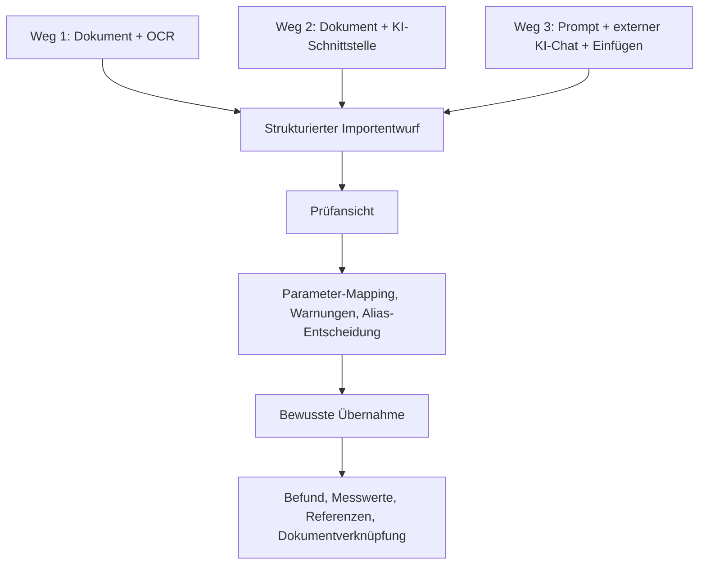

# Zielbild Dreiwege-Import und KI-Extraktion

## Kurzfassung
Der geplante Import soll drei Wege anbieten, die alle in dieselbe bestehende Prüf- und Freigabestrecke münden:

1. Dokument hochladen und lokal oder serverseitig per OCR beziehungsweise Parser analysieren.
2. Dokument hochladen und über eine angebundene KI-Schnittstelle in strukturierte Importdaten übersetzen lassen.
3. Einen vorbereiteten Prompt aus der Anwendung kopieren, in einem externen KI-Chat zusammen mit dem Dokument verwenden und das erzeugte Ergebnis wieder in die Importfunktion einfügen.

Für V1 ist JSON die günstigste Zielstruktur, nicht XML. Der Grund ist praktisch: Es existiert bereits ein versionierter Importvertrag `import-v1.schema.json`, der direkt von `/api/importe/entwurf` verarbeitet wird. Alle drei Wege sollen deshalb am Ende ein gültiges Import-V1-JSON erzeugen oder in ein solches überführt werden.

## Leitprinzip
Die Extraktion ist nur eine Vorstufe. Kein Importweg soll Laborwerte stillschweigend direkt in Befunde und Messwerte schreiben. Jeder Weg erzeugt zuerst einen Importentwurf, der anschließend in der bestehenden Prüfansicht kontrolliert, gemappt, bestätigt, verworfen oder übernommen wird.



## Fachliches Extraktionsziel
Alle drei Wege sollen aus einem Laborbericht mindestens diese Informationen erkennen und strukturiert vorschlagen:

- Labor: vorhandenes Labor sicher wiedererkennen oder neuen `laborName` vorschlagen.
- Person: vorhandene Person möglichst nicht automatisch anhand unsicherer Dokumentdaten zuordnen; stattdessen `personHinweis` oder eine bewusste Auswahl in der Anwendung verwenden.
- Befunddaten: Entnahmedatum, Befunddatum, Dokumentbezug und Befundbemerkung.
- Messwerte: Originalname des Parameters, Rohwert, numerischer Wert, Wertoperator, Einheit und Werttyp.
- Referenzen: originaler Referenztext, strukturierte Unter- und Obergrenzen, Referenzeinheit, Geschlechts- oder Alterskontext, soweit im Dokument erkennbar.
- Qualitative Befunde: Textwerte wie `positiv`, `negativ`, `unauffällig`, `++` oder erläuternde Aussagen als Textwert oder Bemerkung erhalten.
- Sonstige relevante Ausführungen: Kommentare, Methodenhinweise, auffällige Interpretationshinweise des Labors und Einschränkungen als kurze oder lange Bemerkung übernehmen.
- Gruppen oder Berichtsblöcke: falls ein Bericht erkennbare Abschnitte wie `Blutbild`, `Schilddrüse`, `Mineralstoffe` enthält, daraus optionale `gruppenVorschlaege` ableiten.
- Parameter-Vorschläge: wenn ein Messwert nicht sicher zu einem vorhandenen Parameter passt, kann die KI optional einen geprüften Vorschlag mit Anzeigename, kurzer Beschreibung, Einheit, Werttyp, Alias-Hinweisen und Bezug auf Messwert-Indizes liefern.
- Die Kurzbeschreibung eines Parameter-Vorschlags soll eine allgemeine, vom konkreten Bericht und Import unabhängige Fachbeschreibung sein: Was misst der Parameter oder wofür steht er typischerweise als Laborparameter? Berichtsbezogene Hinweise wie Abschnitt, Methode, Einheit aus dem Dokument oder Ableitungsgrund gehören stattdessen in `begruendungAusDokument`.

## Weg 1: Dokument-Upload mit OCR
Dieser Weg ist der produktinterne technische Extraktionsweg ohne externe KI-Verarbeitung.

Geplanter Ablauf:
1. Nutzer lädt PDF, Bild oder Scan in der Importfunktion hoch.
2. Die Anwendung speichert das Originaldokument optional als Dokumentquelle.
3. Eine OCR- oder PDF-Textstufe gewinnt Text, Tabellen und Seitenstruktur.
4. Ein Parser versucht, Labor, Datumsfelder, Parameterzeilen, Werte, Einheiten, Referenzen und Kommentare zu erkennen.
5. Aus dem Ergebnis wird ein Import-V1-JSON erzeugt.
6. Die Anwendung legt daraus einen Importentwurf an.
7. Der Nutzer prüft, mappt und übernimmt wie bei jedem anderen Import.

Stärken:
- Datenschutzfreundlicher, wenn OCR lokal erfolgt.
- Kein externer KI-Dienst nötig.
- Wiederholbar und gut testbar bei standardisierten Laborlayouts.

Grenzen:
- Schwieriger bei schlechten Scans, mehrspaltigen Layouts, handschriftlichen Anteilen, verschachtelten Referenzen oder stark variierenden Laborformaten.
- Qualitative Kommentare und tabellenübergreifende Zusammenhänge können ohne KI schwer zuverlässig interpretiert werden.

## Weg 2: Dokument-Upload mit angebundener KI-Schnittstelle
Dieser Weg nutzt eine konfigurierte KI-Schnittstelle innerhalb der Anwendung.

Geplanter Ablauf:
1. Nutzer lädt das Dokument in der Importfunktion hoch.
2. Die Anwendung stellt der KI das Dokument, den aktuellen Importvertrag, Extraktionsregeln und optional ausgewählte Stammdaten bereit.
3. Die KI extrahiert die fachlichen Inhalte und erzeugt ein gültiges Import-V1-JSON.
4. Die Anwendung validiert das JSON streng gegen das Importschema.
5. Bei gültigem Ergebnis entsteht ein Importentwurf; bei Problemen wird eine verständliche Korrektur- oder Rückfrageanzeige erzeugt.
6. Der Nutzer prüft und übernimmt den Entwurf in der normalen Importstrecke.

Die KI-Schnittstelle soll nicht frei „Datenbankaktionen“ erfinden. Ihr Zielartefakt ist ein strukturierter Importentwurf. Stammdatenvorschläge können später zusätzlich in einem Assistenz-Umschlag mitgegeben werden, gehören aber nicht ungeprüft direkt in die Datenbank.

## Weg 3: Prompt für externen KI-Chat
Dieser Weg ist der manuelle, aber sehr flexible KI-Weg.

Geplanter Ablauf:
1. Die Importfunktion erzeugt einen kopierbaren Prompt.
2. Optional fügt die Anwendung Stammdatenkontext an, zum Beispiel bekannte Labore, Parameter, Aliasse, Einheiten und Gruppen.
3. Der Nutzer öffnet einen externen KI-Chat, fügt Prompt und Dokument hinzu und lässt die Extraktion ausführen.
4. Die KI gibt zuerst einen kurzen Überblick zur Extraktion aus und danach das Import-V1-JSON in einem `json`-Codeblock.
5. Der Nutzer kopiert entweder nur den JSON-Codeblock oder die komplette KI-Antwort zurück in die Importfunktion.
6. Im selben Schritt kann der Nutzer das Dokument hochladen, das der externe KI-Chat analysiert hat.
7. Die Anwendung extrahiert den JSON-Codeblock, validiert ihn, speichert das Dokument optional als Importquelle und erstellt daraus einen normalen Importentwurf.

Dieser Weg ist besonders nützlich, solange Weg 1 und Weg 2 technisch noch nicht voll ausgebaut sind. Er ist außerdem ein guter Testweg für Promptqualität, typische Fehler und notwendige Schemaerweiterungen.

## Gemeinsames Zielartefakt: Import-V1-JSON
Das direkte Ziel für alle drei Wege ist ein JSON-Objekt nach `import-v1.schema.json`.

Pflichtstruktur:

```json
{
  "schemaVersion": "1.0",
  "quelleTyp": "ki_json",
  "personHinweis": "optional",
  "befund": {
    "personId": "optional, nur bei sicherem Kontext",
    "laborId": "optional, nur bei sicherem Match",
    "laborName": "optional, wenn kein sicheres laborId-Match existiert",
    "entnahmedatum": "YYYY-MM-DD",
    "befunddatum": "YYYY-MM-DD",
    "bemerkung": "optional",
    "dokumentPfad": "optional"
  },
  "messwerte": [
    {
      "parameterId": "optional, nur bei sicherem Match",
      "originalParametername": "Ferritin",
      "wertTyp": "numerisch",
      "wertOperator": "exakt",
      "wertRohText": "41",
      "wertNum": 41,
      "einheitOriginal": "ng/ml",
      "referenzTextOriginal": "30-400 ng/ml",
      "untereGrenzeNum": 30,
      "obereGrenzeNum": 400,
      "referenzEinheit": "ng/ml",
      "bemerkungKurz": "optional",
      "bemerkungLang": "optional",
      "unsicherFlag": false,
      "pruefbedarfFlag": false
    }
  ],
  "gruppenVorschlaege": [
    {
      "name": "Eisenstoffwechsel",
      "beschreibung": "optional",
      "messwertIndizes": [0]
    }
  ],
  "parameterVorschlaege": [
    {
      "anzeigename": "Lipoprotein a",
      "wertTypStandard": "numerisch",
      "standardEinheit": "mg/dl",
      "beschreibungKurz": "Allgemeine, berichtsunabhängige Fachbeschreibung des Parameters",
      "moeglicheAliase": ["Lp(a)"],
      "begruendungAusDokument": "Berichtsbezogene Anmerkung, warum der Vorschlag zu den Messwerten passt",
      "unsicherFlag": false,
      "messwertIndizes": [0]
    }
  ]
}
```

Wichtige Einschränkung: Das aktuelle Schema erlaubt nur die explizit definierten Felder. `parameterVorschlaege` sind inzwischen Teil des Import-V1-JSON, bleiben aber reine Prüfvorschläge. Sie legen keine Stammdaten automatisch an, sondern werden erst bei einer bewussten Neuanlage im Schritt `Messwerte klären` für Anzeigename, Beschreibung, Werttyp und Einheit genutzt.

## Optionaler Assistenz-Umschlag für spätere Ausbaustufen
Für die direkte Verarbeitung im heutigen Import darf nur das reine Import-V1-JSON eingefügt werden. Für Weg 2 oder spätere Komfortfunktionen kann zusätzlich ein maschinenlesbarer Umschlag sinnvoll werden:

```json
{
  "importPayload": {},
  "stammdatenVorschlaege": {
    "labore": [],
    "parameter": [],
    "einheitenAliasse": [],
    "gruppen": []
  },
  "rueckfragen": [],
  "extraktionsHinweise": []
}
```

Dieser Umschlag wäre ein eigener Vertrag und ist nicht identisch mit `import-v1.schema.json`. Er wäre nützlich, wenn die KI neben importierbaren Messwerten auch neue Parameter, Laboraliasse, Einheitenaliase oder Rückfragen strukturiert vorschlagen soll.

## Optionaler Stammdatenkontext für KI und Prompt
Die Anwendung kann dem KI-Weg optional Kontext mitgeben. Dieser Kontext soll der KI beim Matching helfen, ist aber nicht Teil des finalen Importpayloads.

Sinnvolle optionale Kontextblöcke:

- Bekannte Labore: `id`, `name`, optionale Aliasse oder Adresshinweise.
- Bekannte Parameter: `id`, `anzeigename`, `internerSchluessel`, `aliase`, `standardEinheit`, `wertTypStandard`, optional Gruppen.
- Bekannte Einheiten: kanonische Einheit und bekannte Alias-Schreibweisen.
- Bekannte Gruppen: Gruppenname und enthaltene Parameter, damit Berichtsblöcke besser vorgeschlagen werden können.
- Optional bekannte Personen: nur wenn Datenschutz und konkreter Workflow das erlauben; für externe KI-Chats sollte dieser Block standardmäßig eher weggelassen oder bewusst vom Nutzer aktiviert werden.

Beispiel für einen kompakten Kontextblock:

```json
{
  "bekannteLabore": [
    {
      "id": "labor-uuid",
      "name": "Bioscientia",
      "aliase": ["bioscientia MVZ"]
    }
  ],
  "bekannteParameter": [
    {
      "id": "parameter-uuid",
      "anzeigename": "Ferritin",
      "internerSchluessel": "ferritin",
      "aliase": ["Ferritin i.S.", "Ferritin im Serum"],
      "standardEinheit": "ng/ml",
      "wertTypStandard": "numerisch"
    }
  ],
  "bekannteEinheiten": [
    {
      "kuerzel": "Tsd./µl",
      "aliase": ["/nl", "G/l"]
    }
  ]
}
```

## Matching-Regeln
Die KI oder OCR-Stufe soll konservativ matchen:

- `laborId` nur setzen, wenn der erkannte Laborname eindeutig zu einem bekannten Labor passt.
- Sonst `laborName` setzen und die spätere Anwendung entscheiden lassen, ob ein Labor neu angelegt oder gemappt wird.
- `parameterId` nur setzen, wenn Name, Alias oder interner Schlüssel eindeutig zu genau einem bekannten Parameter passen.
- Bei unsicherem Parametermatch `parameterId` weglassen, `originalParametername` exakt aus dem Bericht übernehmen und `pruefbedarfFlag` setzen.
- Wenn ein Parameter nicht sicher bekannt ist, kann zusätzlich `parameterVorschlaege` gefüllt werden. Der Vorschlag soll den späteren Prüfschritt erleichtern, ersetzt aber keine sichere Zuordnung.
- In `parameterVorschlaege` ist `beschreibungKurz` strikt berichtsunabhängig zu halten. Hinweise wie „Der Befund nennt...“, konkrete Methoden-, Abschnitts-, Einheits- oder Referenzbezüge aus dem analysierten Bericht gehören in `begruendungAusDokument`, nicht in die spätere Parameterbeschreibung.
- Aliasse nicht automatisch als Stammdaten ändern. Wenn ein erkannter Originalname offensichtlich eine alternative Schreibweise eines vorhandenen Parameters ist, kann im Importpayload `aliasUebernehmen: true` vorgeschlagen werden; die finale Entscheidung bleibt in der Prüfansicht.
- Einheiten nie stillschweigend umrechnen, außer eine sichere, im System bekannte Umrechnungsregel wird gezielt angewendet. Für die Extraktion reicht meistens `einheitOriginal`.
- Widersprüchliche Angaben, unleserliche Stellen oder geschätzte Tabellenzuordnungen müssen als Prüfbedarf sichtbar bleiben.

## Wert- und Referenzregeln
Für Messwerte gelten diese Regeln:

- Der sichtbare Originalwert aus dem Dokument gehört immer in `wertRohText`.
- Dezimalkommas dürfen für `wertNum` in JSON-Dezimalpunkte umgewandelt werden.
- `<`, `<=`, `>`, `>=` und ungefähr-Angaben werden über `wertOperator` modelliert.
- Erlaubte Wertoperatoren sind `exakt`, `kleiner_als`, `kleiner_gleich`, `groesser_als`, `groesser_gleich`, `ungefaehr`.
- Numerische Werte bekommen `wertTyp: "numerisch"` und möglichst `wertNum`.
- Qualitative Werte bekommen `wertTyp: "text"` und `wertText`.
- Der originale Referenztext bleibt in `referenzTextOriginal` erhalten, auch wenn Unter- und Obergrenzen zusätzlich strukturiert werden.
- Strukturierte Referenzgrenzen nur setzen, wenn sie sicher aus dem Dokument hervorgehen.
- Alters- und geschlechtsbezogene Referenzkontexte sollen in die vorhandenen Felder `referenzGeschlechtCode`, `referenzAlterMinTage`, `referenzAlterMaxTage` und `referenzBemerkung`.

## Prompt-Inhalt für Weg 3
Der von der Anwendung erzeugte Prompt soll aus diesen Teilen bestehen:

1. Rolle und Ziel: Die KI ist ein Extraktionshelfer für Laborberichte und soll ein Import-V1-JSON erzeugen.
2. Ausgabevorgabe: kurzer Überblick für den Anwender und danach genau ein `json`-Codeblock mit dem vollständigen Import-V1-JSON.
3. Importvertrag: erlaubte Felder, Pflichtfelder, Enums und `additionalProperties: false`.
4. Extraktionsregeln: Labor, Befunddaten, Messwerte, Referenzen, qualitative Werte, Kommentare.
5. Matching-Regeln: vorhandene IDs nur bei sicherem Match verwenden, sonst Originaltext und Prüfbedarf.
6. Unsicherheitsregeln: nichts erfinden, unlesbare oder mehrdeutige Angaben markieren.
7. Optionaler Stammdatenkontext: bekannte Labore, Parameter, Aliasse, Einheiten und Gruppen.
8. Dokumentanweisung: Das angehängte Dokument vollständig auswerten, inklusive Tabellen, Fußnoten und Kommentaren.
9. Rückgabeformat: erst Extraktionsüberblick, dann kopierbarer `json`-Codeblock nach `schemaVersion: "1.0"`.

## Prompt-Vorlage
Diese Vorlage kann als Ausgangspunkt für die spätere Prompt-Erzeugung dienen:

```text
Du bist ein Extraktionshelfer für die Anwendung "Labordaten".

Aufgabe:
Analysiere das angehängte Laborbericht-Dokument vollständig und erzeuge daraus zuerst einen kurzen Überblick und danach ein gültiges JSON-Objekt nach dem Labordaten-Importvertrag V1 in einem Markdown-Codeblock mit Sprache json.

Wichtig:
- Erfinde keine Werte, Datumsangaben, Labore, Parameter, Referenzen oder Einheiten.
- Übernimm Originalbezeichnungen aus dem Dokument so genau wie möglich.
- Nutze vorhandene IDs nur bei eindeutigem Match.
- Wenn etwas unsicher, unleserlich oder mehrdeutig ist, lasse die ID weg und setze "unsicherFlag": true oder "pruefbedarfFlag": true sowie eine kurze Begründung in "bemerkungKurz" oder "bemerkungLang".
- Interpretiere den Befund nicht medizinisch. Es geht nur um strukturierte Datenerfassung.

Zielstruktur:
Gib diese Zielstruktur im json-Codeblock aus:

```json
{
  "schemaVersion": "1.0",
  "quelleTyp": "ki_json",
  "personHinweis": "optional erkannte Person oder leer",
  "befund": {
    "personId": "optional, nur wenn sicher vorgegeben",
    "laborId": "optional, nur bei sicherem Labor-Match",
    "laborName": "optional, wenn kein laborId-Match sicher ist",
    "entnahmedatum": "YYYY-MM-DD",
    "befunddatum": "YYYY-MM-DD",
    "bemerkung": "optional",
    "dokumentPfad": "optional, nur wenn vorgegeben"
  },
  "messwerte": [
    {
      "parameterId": "optional, nur bei eindeutigem Parameter-Match",
      "originalParametername": "Name exakt aus dem Bericht",
      "wertTyp": "numerisch oder text",
      "wertOperator": "exakt, kleiner_als, kleiner_gleich, groesser_als, groesser_gleich oder ungefaehr",
      "wertRohText": "Originalwert aus dem Bericht",
      "wertNum": 0,
      "wertText": "nur bei qualitativen/textlichen Werten",
      "einheitOriginal": "Einheit aus dem Bericht",
      "bemerkungKurz": "optional",
      "bemerkungLang": "optional",
      "referenzTextOriginal": "Original-Referenztext",
      "untereGrenzeNum": 0,
      "untereGrenzeOperator": "groesser_als oder groesser_gleich",
      "obereGrenzeNum": 0,
      "obereGrenzeOperator": "kleiner_als oder kleiner_gleich",
      "referenzEinheit": "Einheit der Referenz",
      "referenzGeschlechtCode": "optional: w, m oder d; sonst Feld weglassen",
      "referenzAlterMinTage": 0,
      "referenzAlterMaxTage": 0,
      "referenzBemerkung": "optional",
      "aliasUebernehmen": false,
      "unsicherFlag": false,
      "pruefbedarfFlag": false
    }
  ],
  "gruppenVorschlaege": [
    {
      "name": "Berichtsabschnitt oder sinnvolle Gruppe",
      "beschreibung": "optional",
      "messwertIndizes": [0]
    }
  ]
}
```

Regeln für Felder:
- Entferne Felder, für die es keinen Wert gibt. Setze keine Platzhalterwerte wie "unbekannt", wenn das Schema das nicht verlangt.
- "entnahmedatum" ist Pflicht. Wenn im Bericht nur ein Befunddatum erkennbar ist, nutze dieses nur dann als Entnahmedatum, wenn der Bericht klar keine andere Entnahmeangabe enthält, und markiere den Befund in "bemerkung".
- Datumsformat ist immer ISO: YYYY-MM-DD.
- Zahlen im JSON verwenden Dezimalpunkt, auch wenn im Dokument ein Dezimalkomma steht.
- "wertRohText" bleibt in der Originalschreibweise aus dem Dokument.
- Bei "<5" ist "wertOperator": "kleiner_als", "wertRohText": "<5" und "wertNum": 5.
- Bei ">200" ist "wertOperator": "groesser_als", "wertRohText": ">200" und "wertNum": 200.
- Bei qualitativen Werten wie "positiv", "negativ", "++", "nicht nachweisbar" nutze "wertTyp": "text" und fülle "wertText".
- Referenzgrenzen nur strukturiert setzen, wenn sie eindeutig sind. Den originalen Referenztext zusätzlich immer erhalten.
- Zusätzliche Labor-Kommentare zu einem Wert gehören in "bemerkungKurz" oder "bemerkungLang".
- Erkennbare Abschnittsüberschriften des Laborberichts können als "gruppenVorschlaege" ausgegeben werden. Die "messwertIndizes" beziehen sich auf die Positionen im "messwerte"-Array, beginnend bei 0.

Bekannte Stammdaten, falls vorhanden:
{{STAMMDATEN_KONTEXT_JSON}}

Dokument:
Bitte werte das angehängte Dokument vollständig aus. Nenne vor dem Codeblock kurz, wie viele Messwerte erkannt wurden und welche Probleme, Unsicherheiten oder unlesbaren Angaben es gab.
```

## Datenschutz und Kontextumfang
Für externe KI-Chats soll der Prompt möglichst sparsam sein. Parameter- und Laborstammdaten sind fachlich hilfreich, enthalten aber weniger persönliche Daten als komplette Personenlisten. Personeninformationen sollten nur dann in den externen Prompt aufgenommen werden, wenn der Nutzer das bewusst auswählt.

Für die angebundene KI-Schnittstelle kann die Anwendung stärker steuern, welche Daten gesendet werden. Trotzdem gilt: Nur Kontext senden, der für die Extraktion wirklich nötig ist.

## Prüf- und Freigabestrecke
Nach der Extraktion sollen alle Wege dieselben Prüfungen nutzen:

- JSON-Schema-Validierung.
- Plausibilitätsprüfung auf Pflichtfelder und Datumsangaben.
- Labor-Mapping oder Neuanlagevorschlag.
- Parameter-Mapping gegen vorhandene Parameter, Namen und Aliasse.
- Warnungen bei fehlender Parameterzuordnung.
- Fehlende Parameterzuordnungen bleiben nur so lange als offener Prüfhinweis sichtbar, bis in `Messwerte klären` ein vorhandener Parameter oder `Neuen Parameter anlegen` gewählt wurde.
- Warnungen bei nicht normierbaren Einheiten.
- Sichtbare Erhaltung von Originalparametername, Originalwert und Originalreferenz.
- Manuelle Bestätigung von Warnungen.
- Bewusste Übernahme oder Verwerfen des Importentwurfs.

## Umsetzungsvorschlag
Die risikoärmste Reihenfolge ist:

1. Promptgenerator für Weg 3 bauen, weil dieser direkt auf dem vorhandenen JSON-Import aufsetzen kann.
2. Optionalen Stammdatenkontext für Prompt und KI-Schnittstelle definieren.
3. Importoberfläche um die drei klaren Einstiegswege erweitern: `Datei/OCR`, `KI-Analyse`, `Prompt verwenden`.
4. Strenge Validierung und gute Fehleranzeige für eingefügtes KI-JSON verbessern.
5. Angebundene KI-Schnittstelle als Weg 2 ergänzen.
6. OCR- und Parserstrecke als Weg 1 entwickeln und anhand realer Laborlayout-Klassen testen.
7. Später bei Bedarf einen Assistenz-Umschlag für Stammdatenvorschläge, Rückfragen und Extraktionshinweise versionieren.

## Umsetzungsstand vom 2026-04-24
Weg 3 ist als erste konkrete Produktstrecke umgesetzt:

- Das Backend stellt `POST /api/importe/prompt` bereit.
- Der Request enthält `personId` sowie optional `dokumentName` und `bemerkung`.
- Die Response enthält `promptText`, `kontextZusammenfassung` und `schemaVersion`.
- Der Personenkontext im Prompt enthält bewusst nur `id` und `anzeigename`.
- Der Prompt enthält bekannte Labore, Parameter mit Aliasen, Einheiten mit Aliasen und Gruppen als Kontext für konservatives Matching.
- Der Prompt instruiert die externe KI ausdrücklich, das angehängte Dokument vollständig auszuwerten und ausschließlich valides Import-V1-JSON mit `quelleTyp: "ki_json"` auszugeben.
- Die Importoberfläche führt den Nutzer nun schrittweise durch Prompt-Erzeugung, JSON-Einfügen, Befundprüfung, Messwertklärung, Warnungsbestätigung, Übernahme, Gruppenentscheidung und Abschluss.
- Die Importoberfläche trennt dafür die Startwege von der Weiterbearbeitung: `KI-Chat`, `CSV/Excel` und `JSON` starten neue Importe, `Import prüfen` bearbeitet den aktuell gewählten Import und `Historie` zeigt frühere Importläufe.
- Offene Importe werden im Tab `Import prüfen` per Badge gezählt; in den Startwegen erscheint ein direkter Hinweislink, damit begonnene Importe nicht übersehen werden.
- Das Import-V1-JSON erlaubt nun optionale `parameterVorschlaege`. Der Prompt weist die externe KI an, solche Vorschläge nur bei nicht sicher gematchten Parametern und nur mit belastbarer Kurzbeschreibung zu liefern.
- `beschreibungKurz` in `parameterVorschlaege` ist inzwischen ausdrücklich als allgemeine, berichtsunabhängige Fachbeschreibung definiert und soll bei neuen Parameter-Vorschlägen aktiv mitgeliefert werden. Der KI-Prompt fordert dafür kurze Recherche beziehungsweise allgemeines Laborwissen an; berichts- oder importbezogene KI-Anmerkungen werden über `begruendungAusDokument` getrennt.
- Der Prompt-Kontext enthält vorhandene Parameter-Aliasse inklusive Parameter-Standardeinheit. Die KI wird angewiesen, einen bereits bekannten Alias als Match auf den vorhandenen Parameter zu behandeln und dann keine erneute Alias-Anlage vorzuschlagen. Die Anwendung löst gleiche Aliasnamen einheitenbewusst auf: Wenn mehrere Parameter denselben Alias tragen, darf nur ein zur Import-Einheit passender eindeutiger Treffer automatisch mappen.
- Die Prüfansicht zeigt Parameter-Vorschläge direkt am betroffenen Messwert. Bei bestätigter Neuanlage kann der Vorschlag Name, Beschreibung, Werttyp und Standardeinheit des neuen Parameters vorbefüllen; ohne bewusste Auswahl entsteht kein neuer Parameter.
- Beim Einfügen des KI-Ergebnisses kann die analysierte Dokumentdatei mit hochgeladen werden. Wenn kein Dokumentname angegeben wird, schlägt das Backend einen Namen aus Entnahmedatum, Person, Labor und `Laborbericht` vor.
- Ein noch nicht übernommener Importversuch kann entweder dokumentiert verworfen oder komplett entfernt werden. Die UI fragt dafür `Was soll mit dem Importversuch passieren?`; beim kompletten Entfernen können Importversuch, Prüfpunkte und optional das verknüpfte Dokument gelöscht werden.
- Die bestehende Importlogik für Schemafehler, Prüfpunkte, Mapping, Dubletten, Alias-Übernahme und Gruppenvorschläge bleibt maßgeblich und wurde nicht durch eine zweite Importlogik ersetzt.

Weg 1 und Weg 2 bleiben weiterhin Zielbild. Es gibt noch keine interne OCR-Extraktion und keine angebundene KI-Schnittstelle, die Dokumente automatisch innerhalb der Anwendung verarbeitet.

## Offene Entscheidungen
- Welche KI-Schnittstelle oder welcher lokale KI-/OCR-Dienst soll für Weg 2 verwendet werden?
- Soll OCR vollständig lokal laufen oder darf es externe Dienste geben?
- Welche Stammdaten dürfen standardmäßig in externen Prompt-Kontext aufgenommen werden?
- Braucht der Importvertrag kurzfristig zusätzliche `quelleTyp`-Werte wie `pdf_ocr`, `ki_api` oder `ki_prompt`, oder reicht vorerst `ki_json`?
- Braucht es zusätzlich zu `parameterVorschlaege` weiterhin einen separaten Assistenzvertrag für neue Labor-, Einheiten- oder weitergehende Stammdatenvorschläge?
- Wie werden Konfidenzen angezeigt, solange das aktuelle Import-V1-Schema keine eigenen Konfidenzfelder erlaubt?

## Abgrenzung zum aktuellen Ist-Stand
Der aktuelle Projektstand kann bereits strukturierte JSON-, CSV- und Excel-Importe prüfen und übernehmen. Der externe Prompt-Weg ist als geführter JSON-Importfluss umgesetzt. Direkter PDF-Upload mit OCR und integrierte KI-Dokumentanalyse sind weiterhin Zielbild und noch nicht als vollständige Produktfunktion vorhanden.
