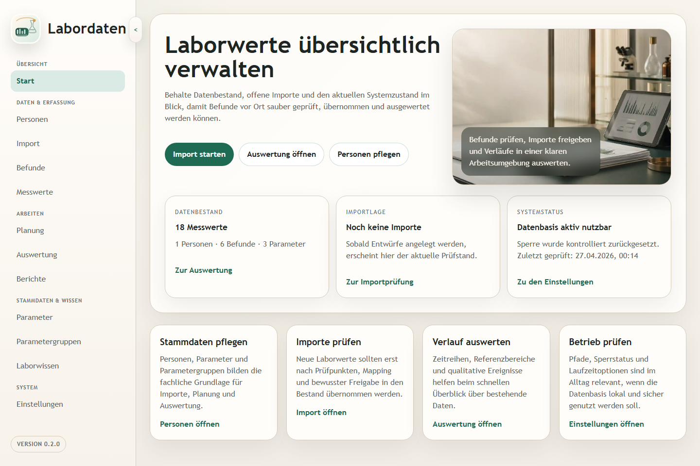
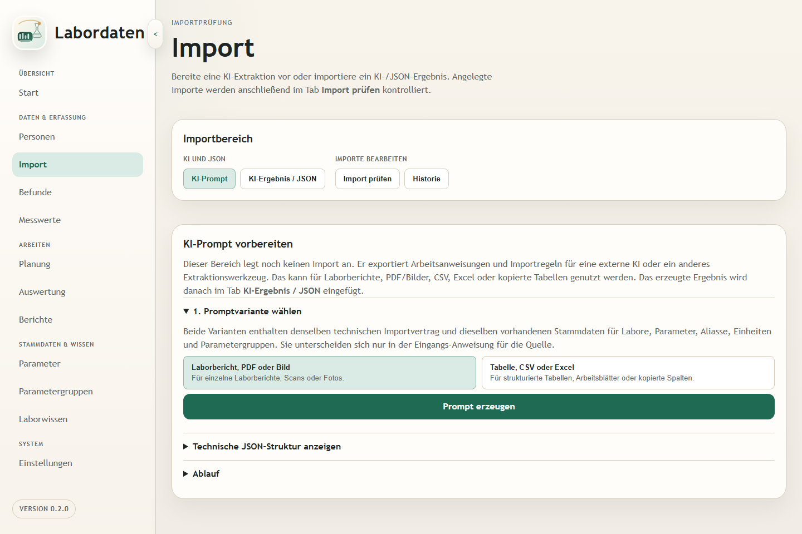
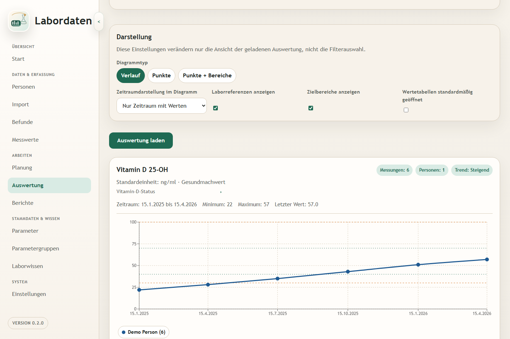

# Labordaten

Version: `0.7.0`

Labordaten ist eine lokale Webanwendung für persönliche und fachlich nachvollziehbare Laborwerte. Laborberichte können mit Hilfe eines externen KI-Chats in strukturierte Daten umgewandelt, anschließend in der Anwendung geprüft und in den eigenen Datenbestand übernommen werden.

Der zentrale Nutzen: weniger Abtippen, mehr Kontrolle. Die übernommenen Werte bleiben lokal, können korrigiert und fachlich zugeordnet werden und stehen danach für Verlaufsdiagramme, Referenz- und Zielbereiche, Planung und PDF-Berichte zur Verfügung.

## Einblicke

Die folgenden Screenshots zeigen synthetische Demo-Daten ohne persönliche Informationen.

### Startübersicht



### KI-Chat-gestützter Import



### Verlaufsdiagramme



## Was die Anwendung kann

### Stammdaten und Laborbestand

- Pflege von Personen, Laboren, Befunden, Messwerten und Laborparametern.
- Nachträgliche Bearbeitung zentraler Stammdaten, ohne technische IDs oder historische Messdaten umzuhängen.
- Parametergruppen mit Many-to-Many-Zuordnung und bereichsübergreifender Filterlogik.
- Referenzbereiche, Zielbereiche, strukturierte Grenzoperatoren und personenspezifische Zielbereichs-Overrides.
- Zentrale Einheitenstammdaten, Einheiten-Aliase, führende Normeinheiten und parameterbezogene Umrechnungsregeln.
- Automatische interne Parameterschlüssel, Alias-Vorschläge, Dublettenprüfung und bestätigte Parameter-Zusammenführung.

### KI-Chat-gestützter Import und Dokumente

- Import ohne Abtippen: Prompt erzeugen, Laborbericht in einem externen KI-Chat analysieren lassen, JSON-Ergebnis einfügen, prüfen und übernehmen.
- Bewusst anschlussfähig an KI-Chats, die viele Nutzer ohnehin schon verwenden; die Anwendung bleibt dabei lokal und übernimmt nur das geprüfte strukturierte Ergebnis.
- Importentwürfe für KI-JSON sowie strukturierte JSON-Daten, CSV- und Excel-Dateien.
- Prüfansicht mit Mapping, Warnungen, Fehlern, Dokumentverknüpfung, Gruppenentscheidungen und bewusster Übernahme.
- Importhistorie mit offenen Importentwürfen, Prüflinks und Statusinformationen.
- Alias-Anlage aus Berichtsschreibweisen beim bestätigten Mapping.
- Optionale Parameter-Vorschläge aus KI-JSON mit Kurzbeschreibung, Einheit, Werttyp und Alias-Hinweisen.

### Planung, Auswertung und Berichte

- Planung zyklischer Kontrollen und einmaliger Vormerkungen.
- Suchbare Mehrfachauswahl für Parameter sowie Gruppen als Eingabehilfe bei der Planungsanlage.
- Fälligkeitsberechnung, Zeitraumansicht für kommende Messungen und PDF-Merkzettel für anstehende Messungen.
- Auswertungsbereich mit übersichtlichen Verlaufsdiagrammen, Referenzlinien, Zielbereichen und gruppenbezogenen Filtern.
- Berichtsbereich mit Vorschauen und PDF-Erzeugung für Arztberichte und Verlaufsberichte.
- Direkter Sprung aus einem Befund-Messwert in die passende Auswertung für Person und Parameter.

### Laborwissen und Betrieb

- Separater fachlicher Markdown-Wissenspool unter `Labordaten-Wissen/`, getrennt von der KI-Projektwissensbasis.
- Lesen, Anzeigen, Verlinken, Neuanlegen und kontrolliertes Löschen von Wissensseiten über die Oberfläche.
- Verknüpfung von Parametern mit Fachwissensseiten; neue Parameter können automatisch eine Ausgangsseite erhalten.
- Anwendungshilfe im Fachwissenspool für die Hauptbereiche der Anwendung.
- Einstellungen für lokale Daten-, Dokument- und Wissenspfade.
- Lokale SQLite-Datenbasis mit Einzelbenutzer-Sperrlogik.
- Zentrale Löschprüfung mit getrennter Ausführung für viele Kernobjekte, unter anderem Personen, Befunde, Messwerte, Importvorgänge, Einheiten, Labore, Parameter, Gruppen, Zielbereiche und Planungen.

### Noch nicht enthalten

- Direkter PDF-Upload mit integrierter OCR- oder Parser-Stufe.
- Direkt angebundene KI-Schnittstelle, die Dokumente innerhalb der Anwendung automatisch analysiert.
- Vollautomatische Übernahme gescannter Laborberichte ohne externe Extraktion oder manuelle Prüfung.

## Technischer Aufbau

Die Anwendung ist als lokales Websystem aufgebaut:

- `apps/backend/`: FastAPI-Backend mit SQLAlchemy, Alembic, Importlogik und PDF-Erzeugung
- `apps/frontend/`: React-Frontend mit Vite für die fachlichen Arbeitsbereiche
- `packages/contracts/`: gemeinsame Import- und API-Verträge
- `KI-Wissen-Labordaten/`: projektbezogene Wissensbasis für wiki-first Arbeit
- `scripts/`: lokale Start- und Hilfsskripte
- `docs/`: ergänzende Projektdokumente außerhalb der Wissensbasis

## Voraussetzungen

- Python `3.11+`
- Node.js mit `npm`
- unter Windows möglichst `pwsh`

## Lokaler Start

### Einmalige Einrichtung

Backend:

```pwsh
pwsh
cd .\apps\backend
python -m venv .venv
.venv\Scripts\Activate.ps1
pip install -e .[dev]
alembic upgrade head
```

Frontend:

```pwsh
pwsh
cd .\apps\frontend
npm install
```

### Beide Prozesse mit einem Aufruf starten

```pwsh
pwsh -File .\scripts\start-dev.ps1
```

Optional mit Migrationen vor dem Backend-Start:

```pwsh
pwsh -File .\scripts\start-dev.ps1 -RunMigrations
```

Optional mit automatischem Öffnen des Frontends im Browser:

```pwsh
pwsh -File .\scripts\start-dev.ps1 -OpenFrontend
```

Das Skript startet Backend und Frontend in getrennten Shell-Fenstern. Für das Backend verwendet es direkt `apps/backend/.venv/Scripts/python.exe`.

### Manuell starten

Backend:

```pwsh
pwsh
cd .\apps\backend
.venv\Scripts\Activate.ps1
uvicorn labordaten_backend.main:app --reload --app-dir src
```

Frontend:

```pwsh
pwsh
cd .\apps\frontend
npm run dev
```

### Standard-URLs

- Frontend: `http://localhost:5173`
- Backend: `http://127.0.0.1:8000`
- API-Dokumentation: `http://127.0.0.1:8000/api/docs`

## Verifikation

Backend-Tests:

```pwsh
cd .\apps\backend
.\.venv\Scripts\python.exe -m pytest
```

Frontend-Tests:

```pwsh
cd .\apps\frontend
npm test
```

Frontend-Produktionsbuild:

```pwsh
cd .\apps\frontend
npm run build
```

## Auslieferung bauen

Ein erster Windows-Release-Prototyp kann als portable Ausgabe gebaut werden:

```pwsh
pwsh -File .\scripts\build-release.ps1
```

Das erzeugt `build/release/Labordaten/` und `build/release/Labordaten-<Version>-portable.zip`. Die enthaltene `Labordaten.exe` startet das Backend im Produktionsmodus, führt Datenbankmigrationen aus, nutzt einen stabilen Datenordner unter `%LOCALAPPDATA%\Labordaten` und öffnet die Anwendung im Browser.

Wenn Inno Setup mit `ISCC.exe` installiert ist, kann zusätzlich ein Windows-Installer gebaut werden:

```pwsh
pwsh -File .\scripts\build-release.ps1 -BuildInstaller
```

## Betriebsnotizen

- Die Datenbank ist lokal und standardmäßig SQLite-basiert.
- Backend-Defaults wie `labordaten.db`, `documents/` und `labordaten.runtime.json` sind relativ zum Startordner des Backends.
- Der kanonische lokale Betrieb startet das Backend deshalb aus `apps/backend`, damit Datenbank, Dokumentablage und Laufzeitdateien konsistent bleiben.
- Die Anwendung ist für lokalen Einzelbetrieb ausgelegt und enthält dafür eine Sperrlogik.

## Wissensbasis

Projektfragen und fachliche Entscheidungen werden wiki-first über `KI-Wissen-Labordaten/` bearbeitet. Relevante Einstiegsseiten sind:

- `KI-Wissen-Labordaten/00 Projektstart.md`
- `KI-Wissen-Labordaten/02 Wissen/00 Uebersichten/Index.md`
- `KI-Wissen-Labordaten/02 Wissen/00 Uebersichten/Aktueller Projektstatus.md`
- `KI-Wissen-Labordaten/02 Wissen/Prozesse/Lokaler Start von Backend und Frontend.md`
