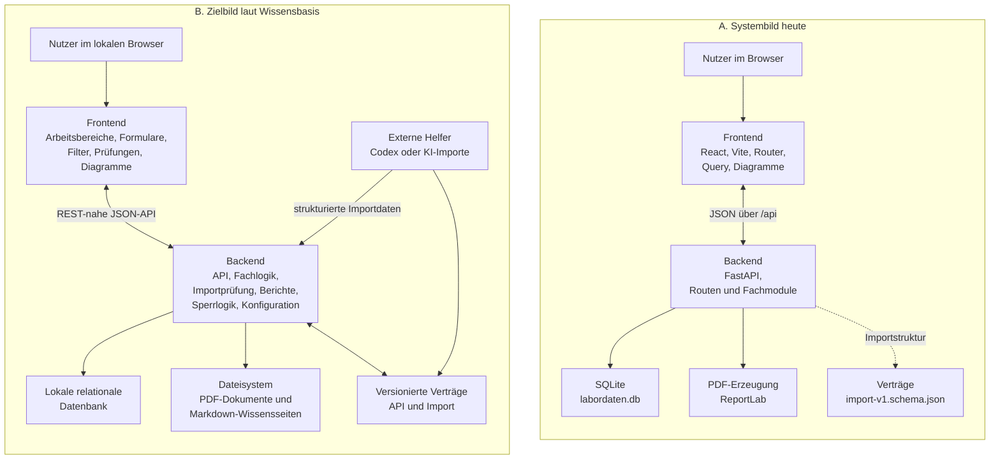
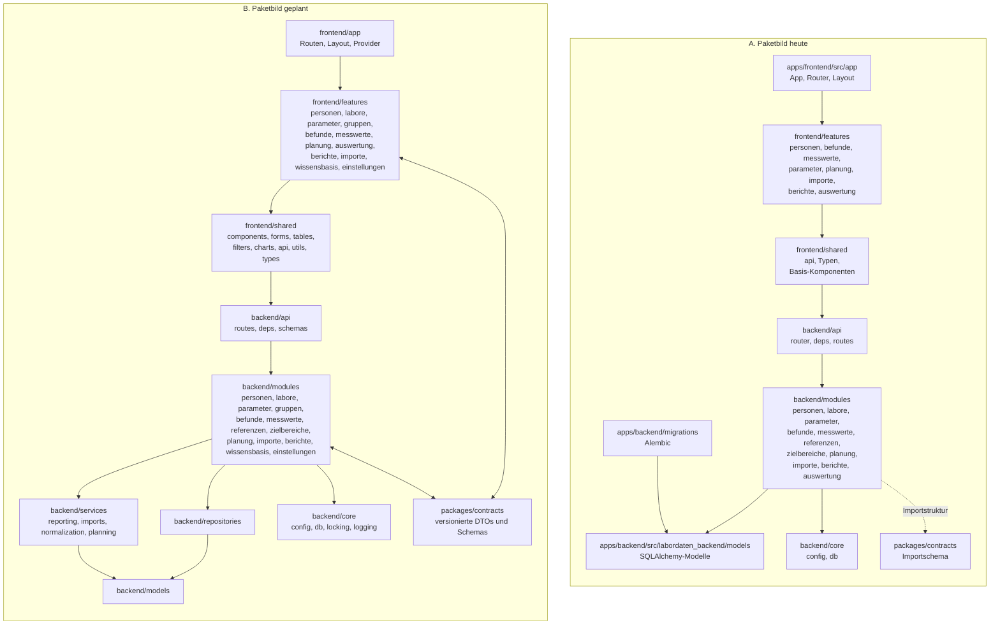
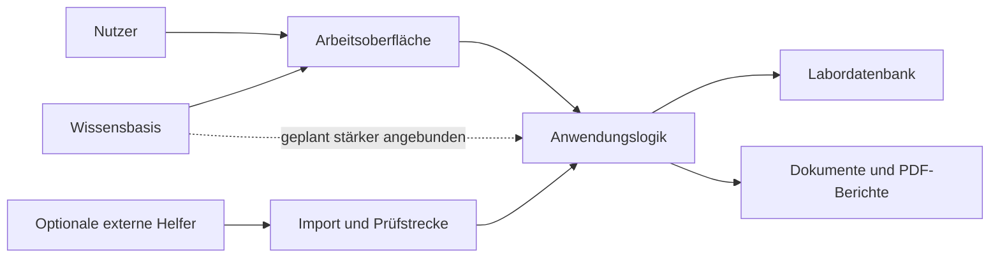

# Systembild und Paketübersicht der Anwendung

## Kurzfassung
Die Anwendung ist aktuell bereits ein lokales Websystem mit React-Frontend, FastAPI-Backend, SQLite-Datenbank, PDF-Erzeugung im Backend und einem separaten Vertragsbereich für strukturierte Importe. Das geplante Zielbild geht darüber hinaus und ergänzt noch fehlende Fachmodule wie Gruppen, Wissensbasis und Einstellungen als eigenständige, sauber angeschlossene Bereiche.

## Einordnung
- Das folgende Ist-Bild beschreibt den aktuellen Workspace-Stand vom 2026-04-21.
- Das Zielbild beschreibt die dokumentierte V1-Architektur aus der Wissensbasis, nicht durchgehend bereits umgesetzten Code.
- Die Wissensbasis `ai-project-memory/` ist projektseitig zentral, ist aber aktuell noch nicht als voll angebundene Laufzeitkomponente der Anwendung umgesetzt.

## Diagramm 1: Systemkomponenten und Zusammenspiel

## Diagramm 2: Programmpakete und Abhängigkeiten

## Diagramm 3: Vereinfachte Managementsicht

## Lesart der Managementsicht
- Der Nutzer arbeitet nur mit der Oberfläche; dort werden Pflege, Suche, Auswertung, Planung und Berichte zusammengeführt.
- Die eigentliche Fachlogik sitzt im Backend und schützt die Datenbank vor direktem Zugriff.
- Importe laufen nicht direkt in die Datenbank, sondern immer erst durch eine Prüf- und Freigabestrecke.
- Dokumente und PDF-Berichte sind ein eigener Ergebnis- und Ablagebereich neben der Datenbank.
- Die Wissensbasis ist fachlich schon zentral, technisch aber aktuell erst teilweise an die Anwendung angebunden.
- Externe Helfer oder KI-nahe Werkzeuge sind optional und sollen nur über definierte Importwege andocken.

## Wichtige Unterschiede zwischen Ist und Zielbild
- Im Backend sind `gruppen`, `wissensbasis` und `einstellungen` als eigene Laufzeitmodule noch nicht sichtbar umgesetzt.
- Im Frontend existieren für `gruppen`, `wissensbasis` und `einstellungen` aktuell nur Platzhalterseiten, keine voll angebundenen Fachbereiche.
- Das Paket `packages/contracts` enthält derzeit im Wesentlichen das Importschema; die breitere Rolle als gemeinsamer Vertragsbereich ist geplant, aber noch nicht voll ausgebaut.
- Backend-Querschnittsbereiche wie `locking`, `logging`, `repositories` und dedizierte `services/` sind im Zielbild beschrieben, im aktuellen Workspace aber nur teilweise oder noch nicht als separate Struktur ausgebildet.
