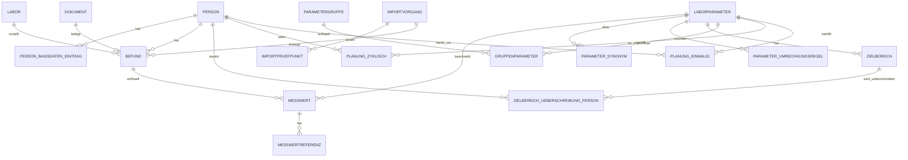

# V1 Ziel-Datenmodell

## Kurzfassung
Das V1-Datenmodell trennt Stammdaten, Messdaten, Referenzlogik, Zielbereiche, Planung, Importprüfung, Dokumente und Wissensverknüpfung sauber voneinander. Es ist auf lokale Nutzung, mehrere Personen, numerische und qualitative Laborbefunde sowie spätere Erweiterbarkeit ausgelegt.

## Modellierungsprinzipien
- Originalinformationen aus Befunden bleiben immer erhalten.
- Abgeleitete oder normierte Werte ergänzen Rohdaten, ersetzen sie aber nie.
- Numerische und qualitative Messwerte leben im selben Fachobjekt, werden aber klar typisiert gespeichert.
- Laborreferenzen der konkreten Messung und allgemeine oder personenbezogene Zielbereiche bleiben getrennt.
- Dokumente und Wissensseiten liegen im Dateisystem; die Datenbank hält nur referenzierende Metadaten.
- Importe werden zuerst als Prüfobjekte behandelt und erst nach Bestätigung in Befunde und Messwerte übernommen.
- V1 optimiert auf fachliche Korrektheit und Nachvollziehbarkeit, nicht auf medizinische Diagnoseautomatik.

## Domänenübersicht
- Stammdaten: Person, Person-Basisdaten-Verlauf, Labor, Laborparameter, Synonyme, Gruppen, Wissensseite
- Messdaten: Befund, Dokument, Messwert, Messwert-Referenz
- Ziel- und Planungslogik: Zielbereich allgemein, Zielbereich Person-Überschreibung, Planung zyklisch, Planung einmalig
- Import: Importvorgang, Import-Prüfpunkt, optionale Import-Artefakte
- Ausgabe und System: Berichtsvorlage, Einstellung, Datenbasis-Sperre

## Zentrale Modellregeln
- `Messwert` speichert immer einen Rohwert als Text.
- Bei numerischen Werten wird zusätzlich ein parsebarer Zahlenwert gespeichert.
- Bei qualitativen Werten bleibt der Zahlenwert leer; stattdessen wird der Textwert verwendet.
- Werte wie `<0,5` oder `>200` brauchen zusätzlich einen Wertoperator.
- `Messwert.person_id` wird in V1 bewusst redundant zum `Befund.person_id` geführt, damit Prüfungen, Filter und Planungsabfragen einfach bleiben.
- `Messwert.laborparameter_id` verweist auf den internen Parameter; der ursprüngliche Name aus dem Befund bleibt separat erhalten.
- Laborreferenzen gehören zur konkreten Messung.
- Zielbereiche gelten allgemein pro Parameter und können personenspezifisch überschrieben werden.
- Bei Zielbereichen schlägt die Person-Überschreibung den allgemeinen Zielbereich.
- Potenzielle Dubletten blockieren nicht hart, sondern erzeugen eine Warnung mit bewusster Übernahmeentscheidung.

## Empfohlene Kern-Enums in V1
- `wert_typ`: `numerisch`, `text`
- `wert_operator`: `exakt`, `kleiner_als`, `kleiner_gleich`, `groesser_als`, `groesser_gleich`, `ungefaehr`
- `referenz_typ`: `labor`, `ziel_allgemein`, `ziel_person`
- `bezugstyp_wissensseite`: `parameter`, `gruppe`
- `planung_intervall_typ`: `tage`, `wochen`, `monate`, `jahre`
- `planung_status`: `aktiv`, `pausiert`, `beendet`
- `vormerkung_status`: `offen`, `naechster_termin`, `erledigt`, `uebersprungen`, `abgebrochen`
- `import_quelle_typ`: `manuell`, `csv`, `excel`, `json`, `ki_json`, `ki_csv`, `pdf_api`, `pdf_manuell`
- `import_status`: `neu`, `in_pruefung`, `freigegeben`, `teilweise_uebernommen`, `uebernommen`, `verworfen`
- `pruefpunkt_status`: `offen`, `warnung`, `fehler`, `bestaetigt`
- `dokument_typ`: `laborbericht_pdf`, `import_rohquelle`, `wissensdatei_link`, `sonstiges`

## Entitäten und Felder

### Person
- `id`: technische Primär-ID
- `anzeigename`: Pflichtfeld für UI und Listen
- `vollname`: optionaler Vollname
- `geburtsdatum`: Pflichtfeld für Auswertung, Planung und Referenzlogik
- `geschlecht_code`: Referenzkategorie für mögliche geschlechtsabhängige Referenzen
- `blutgruppe`: optional
- `rhesusfaktor`: optional
- `hinweise_allgemein`: allgemeine laborrelevante Hinweise
- `aktiv`: Kennzeichen für aktive Nutzung
- `erstellt_am`
- `geaendert_am`

### PersonBasisdatenEintrag
- `id`
- `person_id`
- `typ`: z. B. `gewicht`, `groesse`
- `wert_num`
- `einheit`
- `datum`: fachliches Gültigkeits- oder Messdatum
- `bemerkung`
- `quelle_text`: optionaler Herkunftshinweis
- `erstellt_am`

Regel:
- Pro Eintrag genau ein Typ.
- Historie entsteht durch mehrere datierte Einträge.

### Labor
- `id`
- `name`: Pflichtfeld, eindeutig genug für Alltagsnutzung
- `adresse`: optionaler Adressblock
- `bemerkung`
- `aktiv`
- `erstellt_am`
- `geaendert_am`

### Laborparameter
- `id`
- `interner_schluessel`: stabiler, eindeutiger Parametercode
- `anzeigename`
- `beschreibung`
- `standard_einheit`
- `wert_typ_standard`: `numerisch`, `text` oder später erweiterbar
- `wissensseite_id`: optionaler Verweis
- `aktiv`
- `sortierschluessel`: optional für Listen
- `erstellt_am`
- `geaendert_am`

Regel:
- `interner_schluessel` ist eindeutig.
- `wert_typ_standard` beschreibt den erwarteten Regelfall, blockiert aber Sonderfälle nicht vollständig.

### ParameterSynonym
- `id`
- `laborparameter_id`
- `synonym`
- `labor_id`: optional für laborspezifische Bezeichnungen
- `bemerkung`
- `aktiv`

Regel:
- Dasselbe Synonym darf mehreren Parametern nur dann zugeordnet werden, wenn die Anwendung den Konflikt sichtbar behandelt.

### ParameterUmrechnungsregel
- `id`
- `laborparameter_id`
- `von_einheit`
- `nach_einheit`
- `regel_typ`: z. B. Faktor, Faktor-plus-Offset, Formel
- `faktor`: optional
- `offset`: optional
- `formel_text`: optional für dokumentierte Spezialfälle
- `rundung_stellen`: optional
- `quelle_beschreibung`
- `aktiv`
- `erstellt_am`

Regel:
- Umrechnung ist immer parameterbezogen.
- Nicht sicher umrechenbare Fälle bleiben ohne normierten Wert.

### ParameterBeziehung
- `id`
- `quelle_parameter_id`
- `ziel_parameter_id`
- `beziehungs_typ`: z. B. `verwandt`, `vorstufe`, `ratio_partner`
- `bemerkung`

### ParameterGruppe
- `id`
- `name`
- `beschreibung`
- `wissensseite_id`: optional
- `aktiv`
- `erstellt_am`
- `geaendert_am`

### GruppenParameter
- `id`
- `parametergruppe_id`
- `laborparameter_id`
- `sortierung`: optionale feste Reihenfolge
- `bemerkung`

Regel:
- Ein Parameter kann in mehreren Gruppen vorkommen.

### Wissensseite
- `id`
- `pfad_relativ`: relativer Pfad im Wissensordner
- `titel_cache`: zuletzt bekannter Titel
- `alias_cache`: optional zwischengespeicherte Aliasse
- `frontmatter_json`: optional zwischengespeicherte strukturierte Metadaten
- `letzter_scan_am`
- `aktiv`

Regel:
- V1 braucht primär Anzeige und Öffnen, nicht zwingend eingebettete Bearbeitung.

### Dokument
- `id`
- `dokument_typ`
- `pfad_relativ` oder `pfad_absolut`
- `dateiname`
- `mime_typ`
- `dateigroesse_bytes`
- `checksumme_sha256`: empfohlen für Dublettenerkennung
- `originalquelle_behalten`: Kennzeichen, ob Datei als echte Quelle archiviert werden soll
- `bemerkung`
- `erstellt_am`

Regel:
- Originale Laborberichte sollten bevorzugt als Dokument erhalten bleiben.
- Importquellen aus CSV, Excel oder Text können optional archiviert werden.

### Befund
- `id`
- `person_id`
- `labor_id`
- `dokument_id`: optional
- `entnahmedatum`: fachlich wichtiger als Befunddatum
- `befunddatum`
- `eingangsdatum`: optional für lokale Verwaltung
- `bemerkung`
- `importvorgang_id`: optionaler Herkunftsbezug
- `quelle_typ`: `manuell`, `import`, `ki_import`
- `duplikat_warnung`: optionales Kennzeichen
- `erstellt_am`
- `geaendert_am`

Regel:
- Ein Befund gehört genau zu einer Person.
- Ein Befund kann mehrere Messwerte enthalten.

### Messwert
- `id`
- `person_id`
- `befund_id`
- `laborparameter_id`
- `original_parametername`
- `wert_typ`
- `wert_operator`
- `wert_roh_text`: Pflichtfeld, unverändert aus Erfassung oder Import
- `wert_num`: nur bei numerisch parsebaren Werten
- `wert_text`: normalisierter Text für qualitative Werte
- `einheit_original`
- `wert_normiert_num`: optional
- `einheit_normiert`
- `umrechnungsregel_id`: optional
- `bemerkung_kurz`
- `bemerkung_lang`
- `unsicher_flag`
- `pruefbedarf_flag`
- `importvorgang_id`: optional
- `erstellt_am`
- `geaendert_am`

Regeln:
- Genau einer von `wert_num` oder `wert_text` ist in V1 typischerweise befüllt; `wert_roh_text` bleibt immer erhalten.
- Bei qualitativen Werten bleiben Einheit und normierter Wert in der Regel leer.
- Werte wie `++` oder `positiv` werden als `wert_typ = text` gespeichert.
- `person_id` muss fachlich mit dem übergeordneten Befund übereinstimmen.

### MesswertReferenz
- `id`
- `messwert_id`
- `referenz_typ`: in V1 praktisch meist `labor`
- `referenz_text_original`
- `wert_typ`: `numerisch` oder `text`
- `untere_grenze_num`
- `obere_grenze_num`
- `einheit`
- `soll_text`: für qualitative oder textliche Referenzen
- `geschlecht_code`: optional für strukturierte Varianten
- `alter_min_tage`: optional
- `alter_max_tage`: optional
- `bemerkung`

Regeln:
- Der Originaltext aus dem Befund bleibt erhalten.
- Strukturierte Unter- und Obergrenzen sind Zusatzinformation, kein Ersatz für den Originaltext.
- Auch alters- oder geschlechtsabhängige Referenzvarianten sollen modellierbar sein.

### Zielbereich
- `id`
- `laborparameter_id`
- `wert_typ`
- `untere_grenze_num`
- `obere_grenze_num`
- `einheit`
- `soll_text`
- `geschlecht_code`: optional
- `alter_min_tage`: optional
- `alter_max_tage`: optional
- `bemerkung`
- `aktiv`
- `erstellt_am`
- `geaendert_am`

Regel:
- Zielbereiche sind allgemeine Vorgaben für einen Parameter.
- Für qualitative Parameter kann statt Zahlenbereich ein `soll_text` verwendet werden, falls fachlich sinnvoll.

### ZielbereichUeberschreibungPerson
- `id`
- `person_id`
- `zielbereich_id`
- `untere_grenze_num`
- `obere_grenze_num`
- `einheit`
- `soll_text`
- `bemerkung`
- `aktiv`
- `erstellt_am`

Regel:
- Person-Überschreibungen verweisen bewusst auf einen allgemeinen Zielbereich und ersetzen ihn nur für diese Person.

### PlanungZyklisch
- `id`
- `person_id`
- `laborparameter_id`
- `intervall_wert`
- `intervall_typ`
- `startdatum`
- `enddatum`
- `status`
- `prioritaet`
- `karenz_tage`
- `bemerkung`
- `letzte_relevante_messung_id`: optional als Cache oder Nachvollzug
- `naechste_faelligkeit`: optional materialisiert
- `erstellt_am`
- `geaendert_am`

Regel:
- Die eigentliche Fälligkeit lässt sich aus letzter relevanter Messung plus Intervall ableiten.
- Ein materialisiertes Feld kann die UI beschleunigen, darf aber stets neu berechenbar bleiben.

### PlanungEinmalig
- `id`
- `person_id`
- `laborparameter_id`
- `status`
- `erstellt_am`
- `zieltermin_datum`: optional
- `bemerkung`
- `erledigt_durch_messwert_id`: optional
- `geaendert_am`

Regel:
- Eine Einmalvormerkung wird nur erledigt, wenn der betreffende Parameter tatsächlich neu gemessen wurde oder der Nutzer sie bewusst abschließt.

### Importvorgang
- `id`
- `quelle_typ`
- `status`
- `person_id_vorschlag`: optional
- `dokument_id`: optional
- `roh_payload_text`: optional, z. B. JSON oder CSV-Ausschnitt
- `schema_version`: wichtig für externe Importschnittstellen
- `fingerprint`: optional für Dublettenerkennung
- `warnungen_text`
- `bemerkung`
- `erstellt_am`
- `geaendert_am`

Regel:
- Import und fachliche Übernahme bleiben getrennt.
- Externe Helfer wie Codex liefern bevorzugt strukturierte Importdaten gegen dieses Modell, nicht direkte Datenbankschreibungen.

### ImportPruefpunkt
- `id`
- `importvorgang_id`
- `objekt_typ`: z. B. `befund`, `messwert`, `person`, `parameter`
- `objekt_schluessel_temp`
- `pruefart`: z. B. Dublette, fehlende Einheit, unklare Person, ungemapptes Synonym
- `status`
- `meldung`
- `bestaetigt_vom_nutzer`
- `bestaetigt_am`

### Berichtsvorlage
- `id`
- `name`
- `bericht_typ`: `arztbericht_liste`, `verlauf_zeitachse`, später erweiterbar
- `konfiguration_json`
- `aktiv`
- `erstellt_am`
- `geaendert_am`

Regel:
- V1-Berichte sollen relevante Felder standardmäßig aktiv haben und pro Ausgabe abwählbar machen.

### Einstellung
- `id`
- `schluessel`
- `wert_text`
- `wert_json`
- `bereich`: z. B. `pfade`, `anzeige`, `ki`, `berichte`
- `geaendert_am`

### DatenbasisSperre
- `id`
- `datenbasis_name`
- `geraetename`
- `prozess_info`
- `gesperrt_seit`
- `heartbeat_am`
- `manuell_freigegeben_am`
- `bemerkung`

Regel:
- Pro Datenbasis darf nur eine aktive Sperre bestehen.
- Veraltete Sperren müssen kontrolliert zurücksetzbar sein.

## Beziehungen in Kurzform
- Eine `Person` hat viele `PersonBasisdatenEintrag`.
- Eine `Person` hat viele `Befund`.
- Ein `Labor` hat viele `Befund`.
- Ein `Befund` hat optional ein `Dokument`.
- Ein `Befund` hat viele `Messwert`.
- Ein `Messwert` gehört zu genau einem `Laborparameter`.
- Ein `Messwert` hat null bis viele `MesswertReferenz`.
- Ein `Laborparameter` hat viele `ParameterSynonym`.
- Ein `Laborparameter` hat viele `ParameterUmrechnungsregel`.
- Ein `Laborparameter` ist über `GruppenParameter` mit vielen `ParameterGruppe` verbunden.
- Ein `Laborparameter` hat null bis viele allgemeine `Zielbereich`.
- Ein `Zielbereich` hat null bis viele `ZielbereichUeberschreibungPerson`.
- Eine `Person` hat viele `PlanungZyklisch` und `PlanungEinmalig`.
- Ein `Importvorgang` hat viele `ImportPruefpunkt` und kann zu `Befund` und `Messwert` zurückverfolgbar bleiben.

## Vereinfachtes Beziehungsbild

## Technisch sinnvolle Zusatzfelder, die in der Konzeptvorgabe nicht explizit genannt waren
- `checksumme_sha256` auf Dokumenten für Dublettenerkennung
- `fingerprint` auf Importvorgängen für Wiedererkennung ähnlicher Importe
- `wert_operator` auf Messwerten für `<`, `>` oder `≈`
- `wert_roh_text` zur verlustfreien Speicherung importierter Werte
- `aktiv`-Felder auf Stammdatenobjekten statt harter Löschung
- `erstellt_am` und `geaendert_am` auf zentralen Objekten

## Empfohlene Eindeutigkeiten und Prüfregeln
- `Laborparameter.interner_schluessel` eindeutig
- `Labor.name` in V1 nicht zwingend global eindeutig, aber bei Neuanlage auf Ähnlichkeiten prüfen
- `ParameterSynonym` mindestens pro `laborparameter_id`, `synonym`, `labor_id` eindeutig
- `GruppenParameter` pro Gruppe und Parameter eindeutig
- `ZielbereichUeberschreibungPerson` pro Person und allgemeinem Zielbereich höchstens eine aktive Überschreibung
- `PlanungZyklisch` pro Person und Parameter nur eine aktive Standardplanung, sofern nicht bewusst mehrere Regeln gewünscht sind
- `Messwert.person_id` muss zu `Befund.person_id` passen
- `Messwert.wert_typ = numerisch` erfordert entweder `wert_num` oder einen bestätigten Prüfpunkt
- `Messwert.wert_typ = text` erfordert `wert_text` oder mindestens `wert_roh_text`

## Offene Restpunkte trotz V1-Modell
- Exakte UI-Darstellung qualitativer Werte im Verlaufsbericht ist noch nicht endgültig entschieden.
- Ob Referenzvarianten direkt beim Messwert oder zusätzlich als wiederverwendbare Referenzdefinitionen gepflegt werden, kann später weiter normalisiert werden.
- Die genormte externe Import-Schnittstelle braucht als Nächstes ein konkretes JSON-Schema.
- Für Geschlecht als Referenzkategorie ist noch zu entscheiden, wie frei oder wie strikt die Auswahlliste sein soll.

## Einordnung für die weitere Umsetzung
- Dieses Modell ist für V1 bewusst etwas strenger als eine schnelle Demo.
- Es bildet die kritischen Fachtrennungen bereits so ab, dass spätere Erweiterungen wie KI-Import, normierte Vergleichsansichten oder zusätzliche Zielbereichslogiken nicht an der Basis scheitern.
- Der nächste sinnvolle Schritt ist daraus ein technisches Schema mit Tabellen, Constraints, Indizes und Import-JSON abzuleiten.
